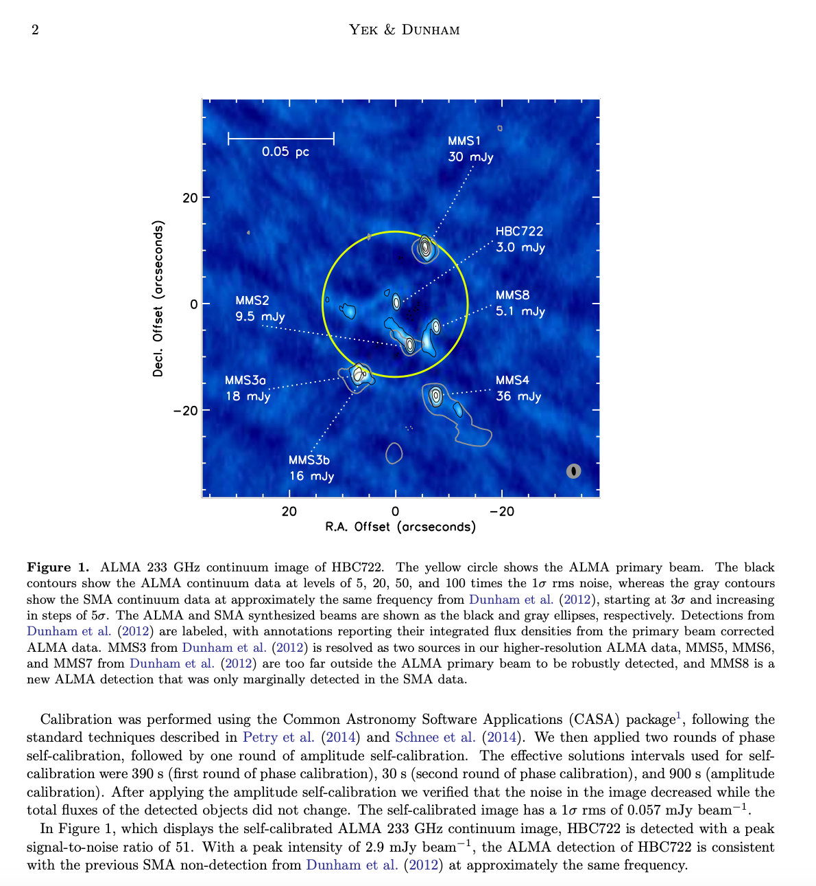
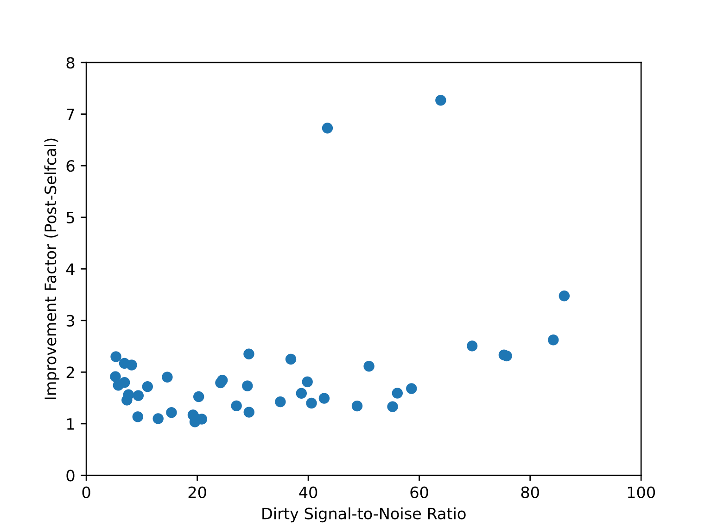
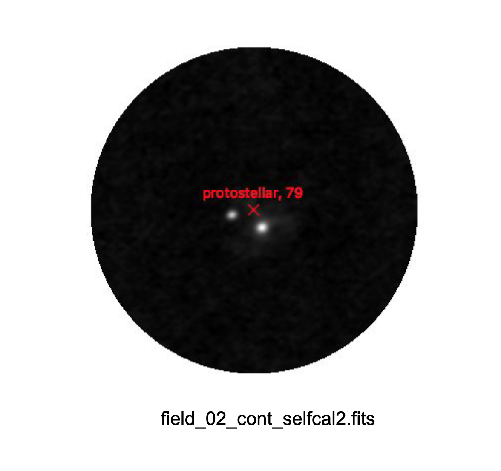
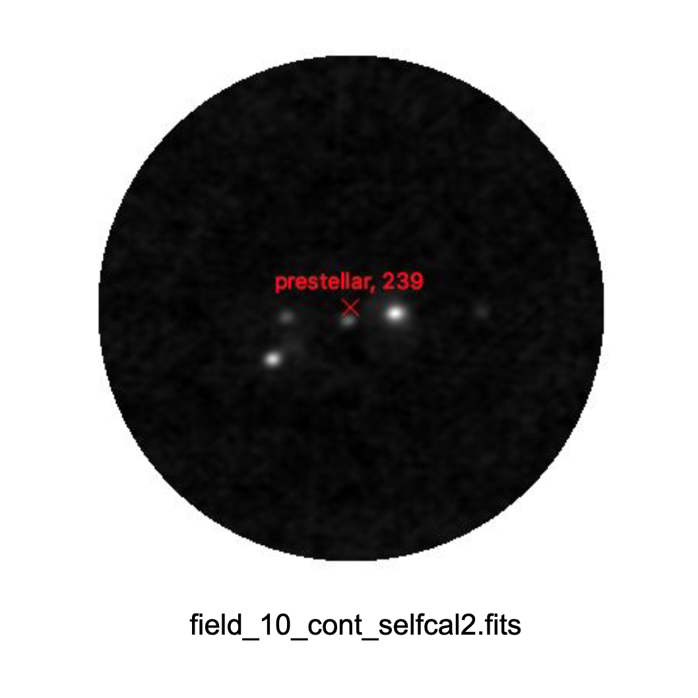
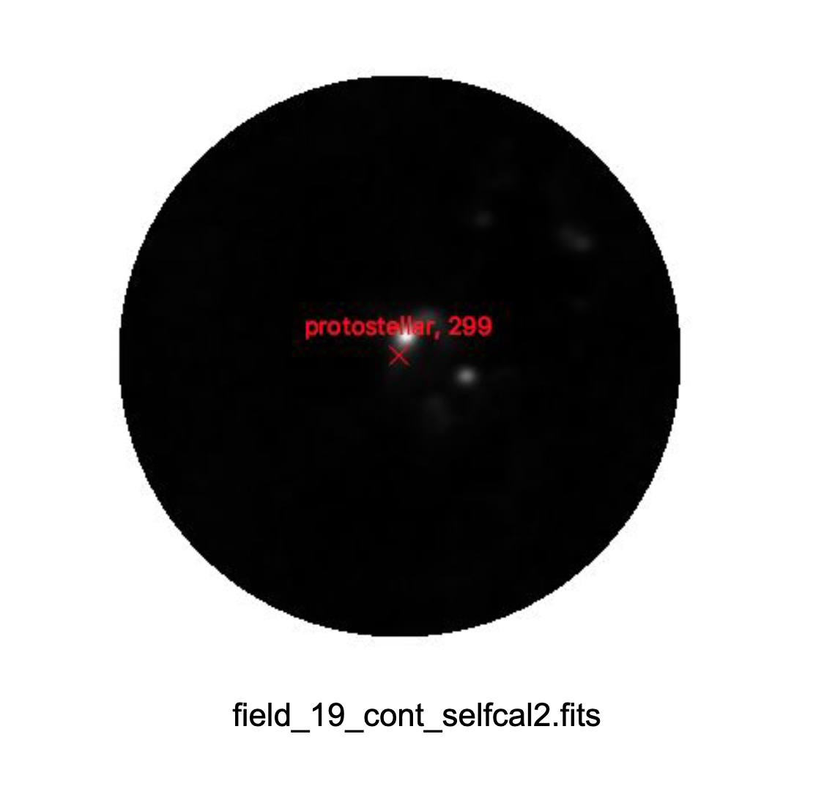

# Core-Fragmentation
Our work focuses on applying self-calibration procedures on ALMA observations using the CASA software package. Please refer to the following snippet from [_Yek et. al. (2020)_](https://arxiv.org/pdf/2009.08019), which elaborates further on the technique's merits. 

The resulting signal-to-noise improvement ranged between 1-3x, sans a few outliers. 

Subsequently, we overlayed the self-calibrated images with known protostellar coordinates, and visually inspected the outputs for signs of fragmentation. We've included a few notable examples below that display such signs (red: previously observed protostars, white: our results that reveal additional structure). 

The full set of outputs are available in `fig/detected_sources.pdf`. 

---

Unfortunately, further analysis of our results has been backlogged indefinitely. Hence, we conclude our contributions here.
